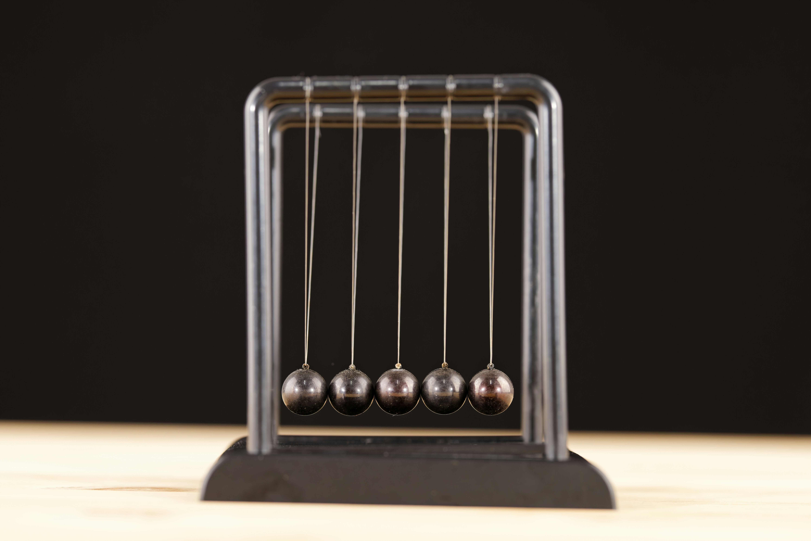

Die **Leistung** beschreibt, wie viel Arbeit pro Zeit verrichtet wird:

$$ P = \frac{W}{t} $$

Dabei ist:

- $P$ die Leistung in Watt (W),
- $W$ die Arbeit in Joule (J),
- $t$ die Zeit in Sekunden (s).

Je größer die Leistung, desto schneller wird Energie umgesetzt.

---



---

<!---


-->
<iframe style="border: 0px; width: 400px; height: 400px;" scrolling="no" src="assets/simulation_1.html"></iframe>

Verbatim Box
```
$$ F_G = m \cdot g $$
```
Formel
$$ F_G = m \cdot g $$

::: info
**Information**

Das ist eine Information.
:::

::: note
**Notiz**

Das ist eine Notiz.
:::

::: example
**Beispiel**

Das ist ein Beispiel.

:::

::: info
    Das ist ein Verbatim Block
:::
